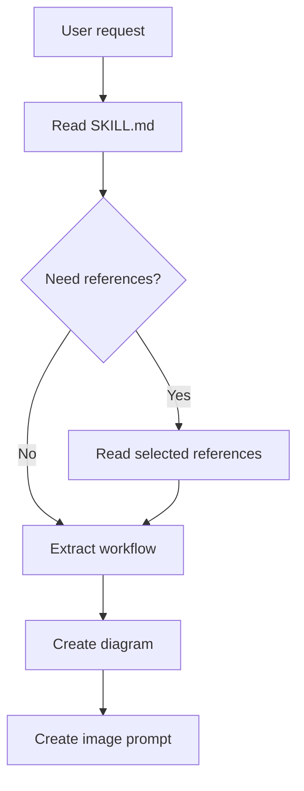

# Skill Visualizer

## Purpose

Turn an existing skill into a readable visual explanation. Prefer a deterministic text diagram first, then create an image-generation prompt, and generate a raster image only when the user asks for an image or when a visual deliverable is clearly requested.

This skill is for understanding and communicating workflows. It does not modify the target skill unless the user separately asks for an edit.

## Supported Targets

Accept any of these target forms:

- Skill name such as `job-flow`, `images-generate`, or `skill-visualizer`
- Absolute or relative path to a skill directory
- Path to a `SKILL.md`
- A pasted `SKILL.md` body

Resolve skill names in this order:

1. Current workspace `.claude/skills/{name}`
2. Current workspace `.agents/skills/{name}`
3. `${CODEX_HOME:-$HOME/.codex}/skills/{name}`
4. `$HOME/.claude/skills/{name}`

If several targets match, state the matches and use the workspace-local skill by default.

## Output Modes

Choose the smallest useful output:

- `map`: one-screen overview of purpose, triggers, inputs, outputs, side effects, and dependencies
- `workflow`: step-by-step flowchart of what Codex should do when the skill runs
- `structure`: file tree plus responsibility map for `SKILL.md`, references, scripts, assets, and agents
- `risk`: approval points, external writes, destructive actions, and validation steps
- `image-prompt`: production prompt for Codex `imagegen` or work-repo `images-generate`
- `image`: generate the image after producing and checking the prompt

If the user does not specify a mode, use `workflow` plus `image-prompt`.

## Reading Workflow

1. Locate the target skill.
2. Read only `SKILL.md` first.
3. Identify directly referenced workflow or reference files that are necessary to explain the requested mode.
4. Read only those referenced files, not the entire skill folder.
5. List scripts and assets by path when relevant, but do not read large scripts unless the workflow depends on their behavior.
6. Extract the workflow into normalized fields:
   - trigger phrases
   - user inputs
   - internal reads
   - external tools or services
   - write/send/delete side effects
   - approval gates
   - validation and post-actions
   - final outputs

Keep the explanation grounded in the files. If a step is inferred rather than written, label it as an inference.

## Diagram Workflow

Create a diagram before creating an image prompt.

Use Mermaid for process diagrams:



Use this visual grammar:

- Rectangle: normal action
- Diamond: decision or approval point
- Stadium: start/end
- Red or warning label in text: destructive, send, write, delete, or external-service action
- Dashed edge: optional branch
- Group related steps by phase when the workflow has more than seven nodes

For structure maps, use a concise tree plus a responsibility table instead of forcing everything into a flowchart.

## Image Prompt Workflow

When an image is requested, create a prompt suitable for a polished infographic, not a decorative illustration.

Default image spec:

- Use case: `infographic-diagram`
- Aspect ratio: `16:9` for docs/slides, `4:5` for SNS, unless the user specifies otherwise
- Style: clean operational dashboard infographic, high contrast, readable labels, restrained color palette
- Text: include only short Japanese labels; avoid dense paragraphs inside the image
- Layout: title, 3-5 phases, key decision points, side-effect warnings, output box

Prompt structure:

```text
Create a clean Japanese workflow infographic for the skill "{skill_name}".
Purpose: {one_sentence_purpose}
Audience: Codex/Claude users who need to understand when and how to use the skill.
Layout: {layout_description}
Diagram content: {nodes_and_edges}
Visual style: clean operational documentation, readable Japanese labels, no decoration-only shapes, no tiny text.
Required labels: {short_labels}
Avoid: overcrowding, tiny text, vague AI-themed decoration, mascot characters unless requested.
Aspect ratio: {ratio}
```

## Choosing The Image Engine

For Codex-global usage, prefer the Codex built-in `imagegen` skill/tool. It is available in Codex and is enough for diagrams, infographics, workflow maps, and visual summaries.

When working inside `/Users/kitamuranaohiro/Private/仕事` and the user explicitly wants the existing work image workflow, use the work-repo `images-generate` skill at `$HOME/.claude/skills/images-generate` or `.claude/skills/images-generate` if available.

Do not call an image engine until the prompt is ready. If the prompt includes many exact Japanese labels, warn that generated raster text may be imperfect and offer a Mermaid/SVG/HTML version for exact text.

## Safety

Reading skill files is safe and needs no confirmation.

Ask before any of these actions:

- Modifying the target skill
- Writing to external services such as Google Drive
- Sending messages, updating spreadsheets, or running production automation described by the target skill
- Deleting, renaming, or overwriting existing files

When generating an image, save project-bound assets inside the relevant workspace if the user names a destination. For preview-only images, inline preview is enough.

## Response Shape

Return results in this order:

1. `対象`: resolved skill path
2. `要点`: purpose, trigger, side effects, output
3. `図解`: Mermaid or structure map
4. `画像プロンプト`: only when image output is requested or useful
5. `次の実行`: image generation path or exact next command/request

Keep the first pass concise. Ask follow-up questions only when the target skill cannot be resolved or when the visual deliverable has an important missing constraint such as aspect ratio or destination.

## References

- Diagram patterns: `references/diagram-patterns.md`
- Prompt templates: `references/image-prompt-templates.md`
