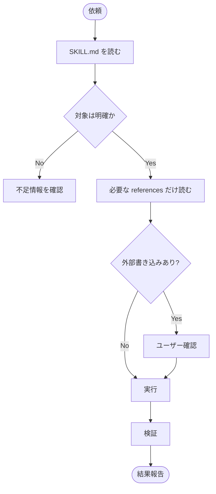

# Diagram Patterns

Use these patterns to convert skill instructions into diagrams.

## Workflow Flowchart

Use when the user wants to understand what happens when a skill runs.

Required fields:

- Start trigger
- Inputs
- Reads
- Decisions
- Approval gates
- Side effects
- Validation
- Final output

Mermaid template:



## Structure Map

Use when the user wants to see how a skill folder is organized.

Output:

```text
skill-name/
├── SKILL.md            # 入口、ルーティング、ガード
├── workflow-a.md       # 実行手順
├── references/         # 必要時に読む詳細
├── scripts/            # 機械的処理
└── agents/             # Codex UI メタデータ
```

Then add a responsibility table:

| Path | Role | When Loaded |
|---|---|---|
| `SKILL.md` | 起動判断と全体手順 | skill 起動時 |
| `references/*.md` | 詳細ルール | 必要時 |
| `scripts/*` | 自動処理 | 実行時 |

## Risk Map

Use when the skill touches external services or user data.

Classify nodes:

- `Read`: local files, DB reads, browser inspection
- `Draft`: message or prompt creation without sending
- `Confirm`: user approval gate
- `Write`: spreadsheet, DB, file, Drive, calendar
- `Send`: LINE, email, chat, external visible action
- `Delete`: destructive action

Always make `Confirm` explicit before `Write`, `Send`, or `Delete`.

## Comparison Map

Use when comparing before/after or multiple skills.

Recommended columns:

- Trigger
- Main workflow
- External dependencies
- Side effects
- Validation
- Output

Prefer a table plus one simplified diagram rather than a large tangled graph.
